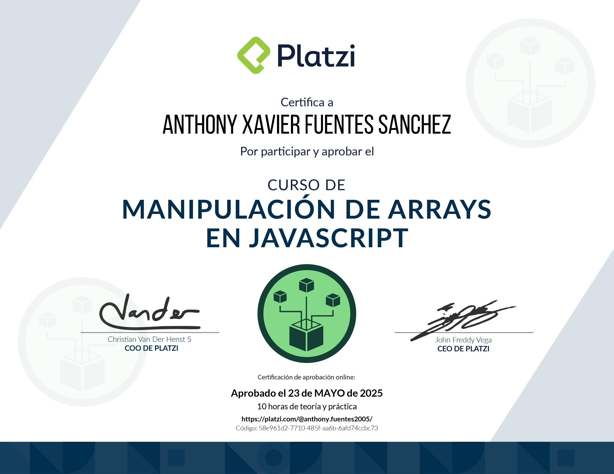

# Notas y Códigos del Curso de Manipulación de Arrays en JavaScript de Platzi

<!-- Reemplaza la línea de arriba con la ruta a tu imagen del diploma cuando lo tengas -->

Este repositorio contiene mis notas personales y los ejercicios de código desarrollados durante el [Curso de Manipulación de Arrays en JavaScript](https://platzi.com/cursos/javascript-arrays/) de Platzi.

## ℹ️ Sobre el Curso

*   **Nombre:** Curso de Manipulación de Arrays en JavaScript
*   **Plataforma:** Platzi
*   **URL:** [https://platzi.com/cursos/javascript-arrays/](https://platzi.com/cursos/javascript-arrays/) <!-- Confirma que esta URL es la correcta -->
*   **Publicado:** 20 de septiembre de 2021
*   **Nivel:** Intermedio
*   **Clases:** 28
*   **Contenido Teórico:** 2 horas
*   **Práctica Estimada:** 8 horas
*   **Descripción:** Domina la manipulación de arrays en JavaScript para optimizar tu código. Aprende desde técnicas básicas como `forEach` y `map` hasta avanzadas como `flatMap` y `reduce`. Mejora la estructuración de datos en frontend y backend.

## 📂 Estructura del Repositorio

Este repositorio está organizado en dos directorios principales:

1.  **`codigos`**: Contiene los ejercicios prácticos, los *playgrounds* y los ejemplos de código vistos durante las clases.
2.  **`notas`**: Contiene apuntes y resúmenes en formato de texto sobre los temas más importantes del curso.

---

## 📚 Temario del Curso

A continuación, se listan las clases del curso:

### Módulo 1: Introducción y Fundamentos
1.  Manipulación de Arrays en JavaScript para Desarrollo Full Stack
2.  Recorrido de Arrays con Foreach en JavaScript
3.  Mutabilidad vs Inmutabilidad en Programación JavaScript
4.  Uso de Map para Transformaciones en JavaScript y Renderizado HTML
5.  Playground: multiplica todos los elementos por dos
6.  Transformaciones avanzadas con map en JavaScript
7.  Playground: calcula y agrega nuevas propiedades a un array
8.  Filtrado de Arrays en JavaScript con el Método Filter
9.  Playground: retorna solo palabras de 4 letras o más
10. Uso del método reduce en JavaScript para sumar elementos de un array
11. Contar elementos en un array con reduce y agrupar por rango
12. Playground: calcula la suma total de elementos en un array

### Módulo 2: Métodos de Búsqueda y Condición
13. Uso de la función "some" en JavaScript para evaluar condiciones
14. Playground: ¿al menos 1 de los números es par?
15. Uso del método `every` en JavaScript para validaciones de arrays
16. Playground: retorna un booleano si todos los elementos son pares
17. Uso de los métodos find y findIndex en JavaScript
18. Uso del método includes en JavaScript para arrays y strings
19. Playground: buscador de palabras con parámetros de búsqueda

### Módulo 3: Métodos de Transformación y Organización
20. Unificación y separación de arrays con join y split en JavaScript
21. Playground: construye URLs a partir de strings
22. Fusión de Arrays con Concat y Operador Spread en JavaScript
23. Aplanar Arrays en JavaScript con Flat y FlatMap
24. Uso de FlatMap para Extraer Fechas de Calendarios en JavaScript
25. Playground: calcula el total de palabras en un texto
26. Métodos Mutables e Inmutables en Arrays: Manipulación y Búsqueda
27. Ordenamiento de Arrays con el Método Sort en JavaScript

### Módulo 4: Cierre del curso
28. Manipulación de Rides con JavaScript

---

**Nota:** Este README está diseñado para organizar mis apuntes y el progreso del curso. Los nombres de las clases y la descripción del curso son propiedad de Platzi.